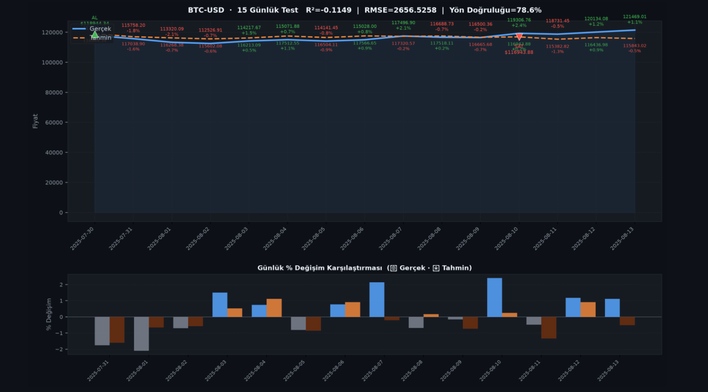

# 📈 Kripto Para Fiyat Tahmini

## Çok Kaynaklı API Entegrasyonu ile Kapsamlı Finansal Veri Toplama ve Makine Öğrenmesi Tabanlı Fiyat Tahmini

> **Veri Madenciliği Lisans Projesi**
> Durum: **Tamamlandı ✅**

---

# 📋 İçindekiler

* Proje Hakkında
* Araştırma Sorusu
* Proje Aşamaları
* Sistem Mimarisi
* Veri Toplama ve Ön İşleme
* Öznitelik Mühendisliği
* Model Eğitimi
* Streamlit Simülasyon Sistemi
* Sonuçlar
* Kurulum
* Kullanım
* Desteklenen Varlıklar
* Proje Yapısı
* Gelecek Çalışmalar
* Referanslar
* Teşekkür
* Sorumluluk Reddi

---

# 🎯 Proje Hakkında

Bu proje, çok kaynaklı API entegrasyonu kullanarak finansal zaman serisi verilerini toplayan, bu veriler üzerinde makine öğrenmesi modelleri eğiten ve elde edilen tahminleri etkileşimli bir alım-satım simülasyonu içerisinde değerlendiren uçtan uca bir finansal tahmin platformudur.

Sistem üç temel bileşenden oluşmaktadır:

* Veri Toplama Katmanı
* Modelleme Katmanı
* Simülasyon ve Görselleştirme Katmanı

Projede Yahoo Finance, Binance ve CoinGecko API'leri kullanılarak hisse senedi, endeks, emtia, döviz ve kripto para verileri elde edilmektedir.

Toplanan veriler üzerinde;

* Veri temizleme
* Eksik veri tamamlama
* Lag Feature üretimi
* Öznitelik seçimi
* Random Forest
* Gradient Boosting

algoritmaları uygulanmaktadır.

Son aşamada eğitilen modeller Streamlit arayüzüne entegre edilmekte ve kullanıcıların farklı yatırım senaryolarını test edebilmeleri sağlanmaktadır.

---

# ❓ Araştırma Sorusu

**Çoklu finansal veri kaynaklarından elde edilen tarihsel fiyat verileri ve gecikmeli öznitelikler kullanılarak kripto para fiyatları ne ölçüde tahmin edilebilir?**

Bu çalışma kapsamında aşağıdaki tahmin ufukları incelenmiştir:

| Tahmin Periyodu | Açıklama       |
| --------------- | -------------- |
| T+3             | 3 Gün Sonrası  |
| T+7             | 7 Gün Sonrası  |
| T+12            | 12 Gün Sonrası |
| T+15            | 15 Gün Sonrası |
| T+30            | 30 Gün Sonrası |

---

# 🗺️ Proje Aşamaları

| Aşama                             | Durum |
| --------------------------------- | ----- |
| Problem Tanımı ve Hedef Belirleme | ✅     |
| Veri Toplama (Multi API)          | ✅     |
| Keşifsel Veri Analizi (EDA)       | ✅     |
| Öznitelik Mühendisliği            | ✅     |
| Model Eğitimi                     | ✅     |
| Performans Değerlendirme          | ✅     |
| Simülasyon ve Görselleştirme      | ✅     |
| Sonuç ve Raporlama                | ✅     |

---

# 🏗️ Sistem Mimarisi

## Veri Toplama Katmanı

Yahoo Finance → Binance → CoinGecko

Sistem veri toplama sırasında kaynakları öncelik sırasına göre kullanmaktadır.

### Uygulanan Temizleme İşlemleri

* Yinelenen tarihlerin kaldırılması
* Sayısal dönüşümler
* Negatif veya sıfır fiyatların temizlenmesi
* Aykırı değer filtreleme
* OHLC tutarlılık kontrolleri

---

## Veri Ön İşleme Katmanı

### Eksik Veri Doldurma

1. Başlangıç eksikleri → 0
2. Enterpolasyon
3. Forward Fill

### Özellik Üretimi

Her sütun için:

* lag_1
* lag_2
* lag_3
* lag_4
* lag_5
* lag_6
* lag_7

özellikleri oluşturulmaktadır.

Bu işlem sonrasında veri setinde 200'den fazla öznitelik elde edilmektedir.

---

## Öznitelik Seçimi

Bu projede öznitelik seçimi için:

**SelectKBest + r_regression**

yaklaşımı kullanılmıştır.

Amaç:

* Hesaplama maliyetini azaltmak
* Gürültüyü azaltmak
* Hedef değişkenle ilişkili öznitelikleri seçmek

Seçilen öznitelik sayısı:

```text
k = 300
```

---

# 🤖 Model Eğitimi

Projede iki farklı regresyon modeli kullanılmıştır.

## Random Forest

```python
RandomForestRegressor(
    n_estimators=3000,
    random_state=42,
    n_jobs=-1
)
```

## Gradient Boosting

```python
GradientBoostingRegressor(
    n_estimators=7000,
    learning_rate=0.005,
    max_depth=7,
    subsample=0.9,
    min_samples_split=3,
    min_samples_leaf=3,
    max_features="sqrt"
)
```

## Eğitim/Test Bölünmesi

```python
X_train, X_test, y_train, y_test = train_test_split(
    X,
    y,
    train_size=0.83,
    random_state=35
)
```

---

## Değerlendirme Metrikleri

| Metrik | Açıklama              |
| ------ | --------------------- |
| R²     | Açıklanan varyans     |
| MSE    | Ortalama karesel hata |
| MAE    | Ortalama mutlak hata  |

---

# 🖥️ Streamlit Simülasyon Sistemi

Sistem Streamlit tabanlı bir kullanıcı arayüzü ile çalışmaktadır.

## Kullanıcı Parametreleri

* Sembol
* Tahmin Periyodu
* İşlem Periyodu
* Eşik Yüzdesi
* Başlangıç Bakiyesi
* Test Modu

## Simülasyon Mantığı

Her gün:

* Model tahmin üretir.
* Tahmin mevcut fiyatın belirlenen eşik kadar üzerindeyse AL yapılır.
* Tahmin belirlenen eşik kadar altındaysa SAT yapılır.
* Aksi durumda pozisyon korunur.

---

## Simülasyon Çıktıları

* Gerçek fiyat grafiği
* Tahmin grafiği
* Alım noktaları (▲)
* Satım noktaları (▼)
* Portföy değeri grafiği
* Buy & Hold karşılaştırması
* Net kâr / zarar
* Maksimum Drawdown
* İşlem geçmişi tablosu

---

# 📊 Sonuçlar

## Örnek Görselleştirme

Aşağıda BTC-USD için model tahmin çıktılarından örnek bir ekran görüntüsü yer almaktadır.

<p align="center">
  
</p>

<p align="center">
<b>Şekil 1.</b> BTC-USD için gerçek fiyat ve model tahminlerinin karşılaştırılması.
Mavi çizgi gerçek fiyatı, turuncu çizgi model tahminini, yeşil (▲) ve kırmızı (▼) işaretler ise simülasyon sırasında oluşan alım ve satım sinyallerini göstermektedir.
</p>

## Simülasyon Sonuçları

Simülasyon sonunda aşağıdaki metrikler hesaplanmaktadır:

* Başlangıç Bakiyesi
* Bitiş Bakiyesi
* Net Kâr/Zarar
* Toplam Getiri (%)
* Toplam İşlem Sayısı
* Kazançlı İşlem Sayısı
* Kazanç Oranı
* Maksimum Drawdown
* Buy & Hold Karşılaştırması

---

# 🚀 Kurulum

## Depoyu Klonlayın

```bash
git clone https://github.com/ihmus/data-mining-project.git

cd data-mining-project
```

## Gereksinimleri Kurun

```bash
pip install -r requirements.txt
```

---

# 💻 Kullanım

## 1. Veri Toplama

```bash
python src/datamining.py
```

## 2. Model Eğitimi

```bash
jupyter notebook src/notebooks/rf_api3_.ipynb
```

Notebook içerisinde:

* Lag özellikleri oluşturulur
* Öznitelik seçimi yapılır
* Model eğitilir
* Model kaydedilir

## 3. Streamlit Arayüzü

```bash
streamlit run src/app.py
```

---

# 📦 Desteklenen Varlıklar

## Endeksler

* S&P 500
* NASDAQ
* Dow Jones
* FTSE
* DAX
* Nikkei
* Euro Stoxx 50
* Shanghai Composite
* Hang Seng
* BIST 100

## Hisseler

* AAPL
* MSFT
* GOOGL
* AMZN
* NVDA
* TSLA
* META
* JPM
* JNJ
* SPGI

## Döviz ve Emtialar

* EUR/USD
* GBP/USD
* USD/JPY
* Altın
* Gümüş
* Ham Petrol
* Doğalgaz
* Bakır
* Mısır
* Buğday
* Soya Fasulyesi

## Kripto Paralar

### Majör

* BTC
* ETH
* XRP
* SOL
* BNB
* DOGE
* AVAX

### Altcoinler

* LINK
* DOT
* UNI
* NEAR
* APT
* OP
* ARB
* BCH
* FIL
* SHIB
* PEPE
* SUI
* STX
* WLD
* ZETA

ve daha fazlası.

---

# 📁 Proje Yapısı

```text
.
├── images
│   └── ldo_usd.png
│
├── results
│   ├── docs
│   ├── reports
│   └── visuals
│
├── src
│   ├── app.py
│   ├── datamining.py
│   ├── graphs.py
│   ├── model_karsilastirma.py
│   ├── multi_model_training.py
│   ├── predict_with_models.py
│   │
│   ├── datas
│   │   └── comprehensive_market_data_200_plus_features.csv
│   │
│   ├── models
│   │   ├── BTC_USD
│   │   ├── ETH_USD
│   │   └── models_info
│   │
│   └── notebooks
│       └── rf_api3_.ipynb
│
├── requirements.txt
├── LICENSE
└── README.md
```

---

# 🔮 Gelecek Çalışmalar

* İşlem maliyetlerinin modellenmesi
* Stop-loss ve Take-profit desteği
* Çoklu varlık portföy optimizasyonu
* Gerçek zamanlı veri akışı
* Canlı işlem entegrasyonu
* LSTM ve GRU modelleri
* Transformer tabanlı zaman serisi modelleri
* Yapay Arı Kolonisi ve Genetik Algoritma tabanlı öznitelik seçimi

---

# 📚 Referanslar

[1] Breiman, L. Random Forests. Machine Learning, 2001.

[2] Drucker, H. Improving Regressors Using Boosting Techniques, 1997.

[3] Karaboga, D. An Idea Based on Honey Bee Swarm for Numerical Optimization, 2005.

[4] Chen, T., Guestrin, C. XGBoost: A Scalable Tree Boosting System, 2016.

[5] Pedregosa, F. et al. Scikit-Learn: Machine Learning in Python, 2011.

[6] Yahoo Finance Documentation.

[7] Binance API Documentation.

[8] CoinGecko API Documentation.

[9] Streamlit Documentation.

[10] Backtrader Documentation.

---

# 🙏 Teşekkür

Bu çalışma Veri Madenciliği dersi kapsamında hazırlanmıştır.

Proje süresince sağladığı yönlendirmeler ve geri bildirimler için danışman hocamız **Hakan Gündüz'e** teşekkür ederiz.

---

# ⚠️ Sorumluluk Reddi

Bu proje yalnızca akademik amaçlarla geliştirilmiştir.

Burada üretilen tahminler yatırım tavsiyesi niteliği taşımamaktadır. Kripto para piyasaları yüksek risk içerir ve gerçek yatırım kararları için kullanılmamalıdır.

---

