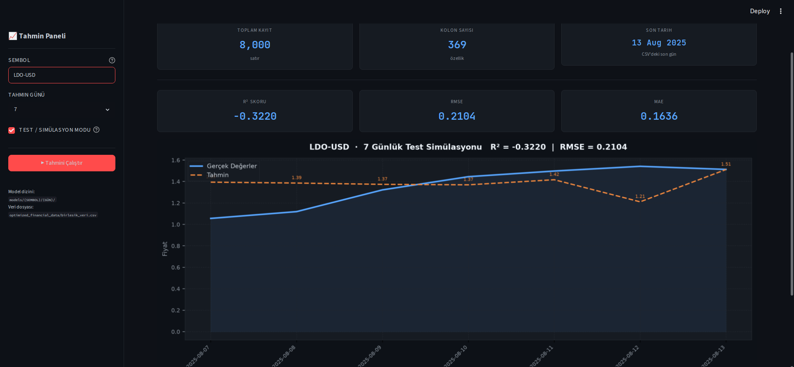

# 📈 Kripto Para Fiyat Tahmini

## Çok Kaynaklı API Entegrasyonu ile Kapsamlı Finansal Veri Toplama ve Makine Öğrenmesi Tabanlı Fiyat Tahmini

> **Veri Madenciliği Lisans Projesi**
> Durum: **Aşama 1–5 Tamamlandı** | **Aşama 6–8 Devam Ediyor**

---

# 📋 İçindekiler

* Proje Hakkında
* Araştırma Sorusu
* Proje Aşamaları
* Veri Kaynakları
* Sistem Mimarisi
* Kurulum
* Kullanım
* Desteklenen Varlıklar
* Teknik Detaylar
* Proje Yapısı
* Sonuçlar
* Referanslar
* Sorumluluk Reddi

---

# 🎯 Proje Hakkında

Bu proje, finansal zaman serisi verilerini çok kaynaklı API entegrasyonu ile toplayarak, makine öğrenmesi tabanlı fiyat tahmin modelleri geliştirmeyi ve bu modelleri interaktif bir alım–satım simülasyonu ile birleştirmeyi amaçlamaktadır.

Sistem;

* Yahoo Finance
* Binance
* CoinGecko

kaynaklarından tarihsel fiyat verilerini otomatik olarak toplamaktadır.

Toplanan veriler üzerinde:

* Veri temizleme
* Eksik veri tamamlama
* Gecikmeli öznitelik (Lag Feature) üretimi
* Korelasyon tabanlı öznitelik seçimi
* Random Forest
* Gradient Boosting

algoritmaları uygulanmaktadır.

Eğitilen modeller Streamlit tabanlı arayüz üzerinden test edilmekte ve oluşturulan işlem sinyalleri Buy & Hold stratejisi ile karşılaştırılmaktadır.

---

# ❓ Araştırma Sorusu

**Çoklu finansal veri kaynaklarından elde edilen tarihsel fiyat verileri ve gecikmeli öznitelikler kullanılarak kripto para fiyatları ne ölçüde tahmin edilebilir?**

Bu kapsamda aşağıdaki tahmin ufukları incelenmektedir:

| Tahmin Ufku | Açıklama       |
| ----------- | -------------- |
| T+3         | 3 Gün Sonrası  |
| T+7         | 7 Gün Sonrası  |
| T+12        | 12 Gün Sonrası |
| T+15        | 15 Gün Sonrası |
| T+30        | 30 Gün Sonrası |

---

# 🗺️ Proje Aşamaları

| Aşama                             | Durum |
| --------------------------------- | ----- |
| Problem Tanımı ve Hedef Belirleme | ✅     |
| Veri Toplama (Multi-API)          | ✅     |
| Keşifsel Veri Analizi (EDA)       | ✅     |
| Öznitelik Mühendisliği            | ✅     |
| Model Eğitimi                     | ✅     |
| Performans Değerlendirme          | ⏳     |
| Simülasyon ve Görselleştirme      | ⏳     |
| Sonuç ve Raporlama                | ⏳     |

---

# 🌐 Veri Kaynakları

| Kaynak        | Amaç                                |
| ------------- | ----------------------------------- |
| Yahoo Finance | Hisse, Endeks, Döviz, Emtia, Kripto |
| Binance API   | Kripto Para Verileri                |
| CoinGecko API | Yedek Kripto Veri Kaynağı           |

## Veri Özellikleri

* Yaklaşık 2000 günlük veri
* Günlük kapanış fiyatları
* Otomatik güncelleme
* Eksik veri düzeltme
* Çoklu API yedekleme mekanizması

---

# 🏗️ Sistem Mimarisi

## Veri Toplama Katmanı

Yahoo Finance → Binance → CoinGecko

Kaynaklardan veri çekilir ve doğrulama işlemlerinden geçirilir.

### Uygulanan Kontroller

* Yinelenen kayıtların silinmesi
* Sayısal veri dönüşümü
* Negatif veya sıfır fiyatların temizlenmesi
* Aykırı değer filtreleme
* OHLC tutarlılık kontrolleri

---

## Veri Ön İşleme Katmanı

### Eksik Veri Doldurma

1. Başlangıç eksikleri → 0
2. Enterpolasyon
3. Forward Fill

### Özellik Üretimi

Her sütun için:

* lag_1
* lag_2
* lag_3
* lag_4
* lag_5
* lag_6
* lag_7

oluşturulur.

Toplamda 200’den fazla öznitelik elde edilmektedir.

---

## Öznitelik Seçimi

Yöntem:

SelectKBest + r_regression

Amaç:

Hedef değişken ile en yüksek korelasyona sahip öznitelikleri seçmek.

Seçilen öznitelik sayısı:

300

---

## Model Eğitimi

### Random Forest

* n_estimators = 3000
* random_state = 42
* n_jobs = -1

### Gradient Boosting

* n_estimators = 7000
* learning_rate = 0.005
* max_depth = 7
* subsample = 0.9
* min_samples_split = 3
* min_samples_leaf = 3

---

# 🚀 Kurulum

## Repository'i Klonlayın

```bash
git clone https://github.com/ihmus/data-mining-project.git
cd data-mining-project
```

## Gereksinimleri Kurun

```bash
pip install -r requirements.txt
```

---

# 💻 Kullanım

## 1. Veri Toplama

```bash
python src/datamining.py
```

Çıktı:

```text
comprehensive_market_data_2000_days.csv
```

---

## 2. Model Eğitimi

```bash
jupyter notebook src/notebooks/rf_api3_.ipynb
```

Notebook içerisinde:

* Lag özellikleri oluşturulur
* Özellik seçimi yapılır
* Model eğitilir
* Model kaydedilir

---

## 3. Streamlit Arayüzü

```bash
streamlit run src/app.py
```

Kullanıcı;

* Sembol seçer
* Tahmin periyodu belirler
* İşlem aralığı seçer
* Simülasyonu çalıştırır

---

# 📦 Desteklenen Varlıklar

## Endeksler

* S&P500
* NASDAQ
* Dow Jones
* DAX
* FTSE
* Nikkei
* BIST100

## Hisseler

* AAPL
* MSFT
* GOOGL
* AMZN
* NVDA
* TSLA
* META
* JPM
* JNJ

## Döviz ve Emtialar

* EUR/USD
* GBP/USD
* USD/JPY
* Altın
* Gümüş
* Ham Petrol
* Doğalgaz
* Bakır

## Kripto Paralar

### Majör

* BTC
* ETH
* XRP
* SOL
* BNB
* DOGE
* AVAX

### Diğer

* LINK
* DOT
* UNI
* NEAR
* APT
* OP
* ARB
* BCH
* FIL
* SHIB
* PEPE
* SUI
* STX
* WLD
* ZETA

ve daha fazlası.

---

# 🔧 Teknik Detaylar

## Eğitim/Test Ayrımı

```python
X_train, X_test, y_train, y_test = train_test_split(
    X,
    y,
    train_size=0.83,
    random_state=35
)
```

## Değerlendirme Metrikleri

| Metrik | Açıklama                |
| ------ | ----------------------- |
| R²     | Açıklanan varyans oranı |
| MSE    | Ortalama karesel hata   |
| MAE    | Ortalama mutlak hata    |

---

# 📁 Proje Yapısı

```text
.
├── images
├── results
├── src
│   ├── app.py
│   ├── datamining.py
│   ├── graphs.py
│   ├── multi_model_training.py
│   ├── predict_with_models.py
│   ├── notebooks
│   ├── datas
│   └── models
├── requirements.txt
├── README.md
└── LICENSE
```

---

# 📊 Sonuçlar

> 📈 **Uygulama Grafik Sonuçları**
>
> Örneğin **LDO-USD** tahmin sonuçları incelendiğinde, bazı günlerde tahminlerde küçük sapmalar görülse de model genel fiyat trendini başarılı şekilde takip edebilmektedir.
>
> Aşağıda model tarafından üretilen tahmin sonuçlarına ait örnek bir ekran görüntüsü yer almaktadır.



**Şekil 1.** LDO-USD için gerçek fiyat ve model tahminlerinin karşılaştırılması. Mavi çizgi gerçek fiyatı, turuncu çizgi model tahminini, yeşil (▲) ve kırmızı (▼) işaretler ise simülasyon sırasında oluşan alım ve satım sinyallerini göstermektedir.


---

# 📚 Referanslar

Breiman, L. (2001). Random Forests. Machine Learning.

Drucker, H. (1997). Improving Regressors Using Boosting Techniques.

Karaboga, D. (2005). An Idea Based on Honey Bee Swarm for Numerical Optimization.

Chen, T., & Guestrin, C. (2016). XGBoost: A Scalable Tree Boosting System.

Pedregosa, F. et al. (2011). Scikit-Learn: Machine Learning in Python.

Yahoo Finance Documentation

Binance API Documentation

CoinGecko API Documentation

Streamlit Documentation

Backtrader Documentation

---

# ⚠️ Sorumluluk Reddi

Bu çalışma tamamen akademik amaçlı hazırlanmıştır.

Üretilen tahminler yatırım tavsiyesi değildir. Kripto para piyasaları yüksek risk içerir ve gerçek yatırım kararları için kullanılmamalıdır.

---

